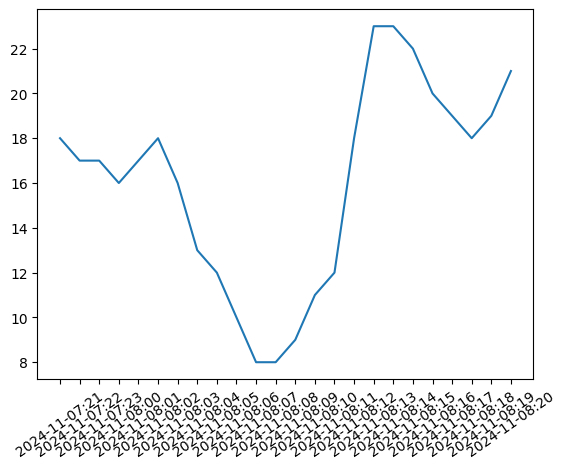

<div align="center">
  
# Air Quality Task [](mailto:mintjjc@gmail.com)

[Overview](#overview) • [`nvim`](#implementation)

</div>

# Overview

This project is an answer to the first task posed to me by the Air Quality Predictions team. The solution involves one central Python file that is run by `script.sh`, and is run regularly with the use of a cron job. Because cron jobs are not easily distributed through version control, I have provided detailed instructions below on how one would use this system in practice the same way it is set up on my current machine.

# Implementation

The implementation of this project was done using Python and no external libraries apart from `matplotlib`. All requirements were generated using `pip freeze > requirements.txt` and can be downloaded onto your local machine. The implementation is relatively simple and uses the data straight from the source. The rough steps the code takes are as follows:

1. Get the current date as a `datetime` object and use it to generate the last 24 hours, each as their separate object.
2. Download from the appropriate link the data that is needed.
3. Parse the data for `BOSTON-KENMORE`, which is the closest geographical location to MIT that shows up consistently in data downloads after scraping information for the past year.
4. Combine all data and plot it, dealing with cases when `BOSTON-KENMORE` lacks data for some reason.

Due to the simplicity of the task, I have not made certain parts of the pipeline as robust as I would have liked. For example, I assume that the 16th column contains the information that we desire `PM2.5_AQI`. Realistically this should not matter as these types of consistent online data sets will not change, but for a fully deployed system I would want to put checks here to make sure that sudden changes to the format were reported somehow to the admin of this program.

The scheduling of the task to run at 8:00 AM Boston time can be done by editing using the `crontab` command on the server. You can edit the command accordingly if the server is not being run in Boston to account for the time delay.

```bash
crontab -e
```

```bash
# contents of crontab -e file

0 8 * * * /path/to/script.sh
```

The script will then be scheduled to run at 8:00 AM each day, which will in turn call the Python program that returns the data for the last 24 hours. The plot is extremely simple, and I have provided an example in this project with the current data as a proof of concept.

<div align="center">
  


</div>

With more time, I would have added units, indicators of missing data, smoothening, and additional labeling to make the graph more clear. If any of these qualities are desired please let me know! I have currently produced a simple graph visualization as more of a proof than a workable model to use in production.
